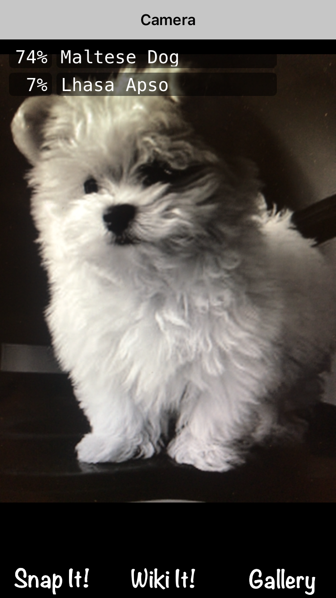
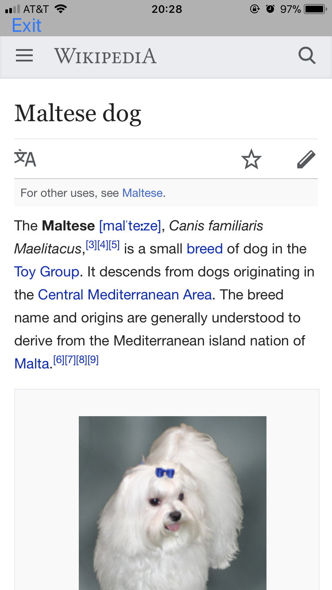
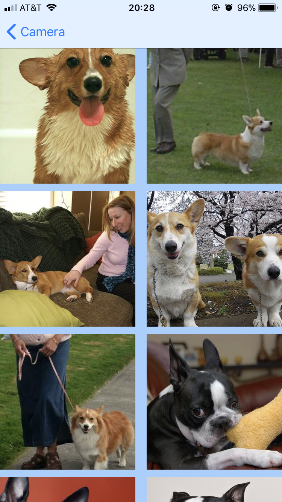

# ADS Project 5: Dog Breed Identifier APP

Term: Fall 2017

+ Team #8
+ Projec title: Dog Breed Identifier APP



+ Team members
	+ Christina Huang - yh2859
	+ Jing Zhao - jz2786
	+ Siyi Wang - sw3120
	+ Chaoyue Tan - ct2774
	+ Yufei Zhao - yz3007
+ Project summary: We harvest data about dogs’ personality, trainability, etc. from  American Kennel Club and more than 120,000 dog images based on 120 dogs from imageNet. Then we use pretrained CNN model to make dog breed prediction by following step:
	+  Load the tensorflow graph and variables pre-trained on the imagenet dataset
	+  Use tensorboard to investigate the graph architecture
	+  Remove the last layer, fix the weights of the remaining layers
	+  Use what remains as a black-box function transforming images into derived feature vectors, and finally fit a new classifier on the derived feature vectors
	+  Evaluate the performance of the fine-tuned model and get 90.4% of accuracy in validation set

	In addition, we integrate CNN trained on tensorflow into iOS App in order to identify the dog breed effectively and conventiently, the App is called *Dog Breed!*


	
**Contribution statement**: ([default](doc/a_note_on_contributions.md)) 
+ Christina Huang(Presenter): iOS App establishment - UI design, "Snap It", "Wiki It" and "Gallgary" view controllor
+ Jing Zhao: vanilla CNN model establishment
+ Siyi Wang: data collection and clean, web scraper for descriptions
+ Chaoyue Tan: updating and finishing pre-trained model (interception v3)
+ Yufei Zhao: assistant for iOS App - "Wiki It" view controllor

Following [suggestions](http://nicercode.github.io/blog/2013-04-05-projects/) by [RICH FITZJOHN](http://nicercode.github.io/about/#Team) (@richfitz). This folder is orgarnized as follows.

```
proj/
├── lib/
├── data/
├── doc/
├── figs/
└── output/
```

Please see each subfolder for a README file.
